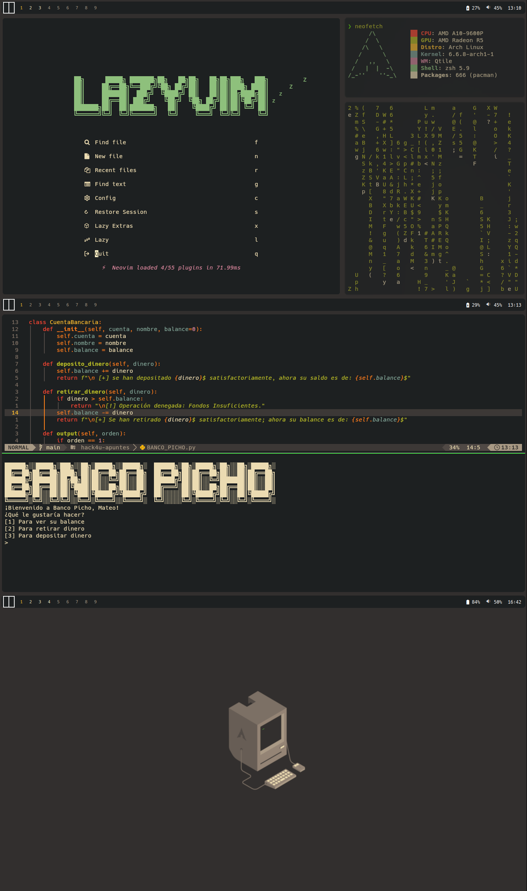

# MY DOTS
This repo contains my personal dots for my qtile's cofig

## INFO
- **OS:** [Arch Linux](https://archlinux.org/)
- **WM:** [Qtile](https://qtile.org/) with [qtile-extras](https://github.com/elParaguayo/qtile-extras)
- **Compositor:** Picom
- **Term:** [Kitty](https://github.com/kovidgoyal/kitty)
- **Shell:** ZSH
- **Launcher:** [Rofi](https://github.com/davatorium/rofi)
- **Clipboard manager** [greenclip](https://github.com/erebe/greenclip) (requires Rofi)
- **Icons:** [Gruvbox Plus icon pack](https://github.com/SylEleuth/gruvbox-plus-icon-pack)
- **GTK:** [Gruvbox-Dark-BL-MOD](https://www.pling.com/p/2046839)
- **Text Editor:** [LazyVim](https://www.lazyvim.org/) with [gruvbox](https://github.com/ellisonleao/gruvbox.nvim)
- **Colorscheme:** Gruvbox

## DEPENDENCIES
Run this command to install all the dependencies available in the **core and extra** repositories of Arch Linux.
~~~
pacman -S xdotool ripgrep feh pipewire-jack pipewire-alsa rofi brightnessctl playerctl scrot
~~~
Run this command to install all the dependencies available in AUR. *Assuming your AUR Helper is [yay](https://github.com/Jguer/yay).*
~~~
yay -S qtile-extras rofi-greenclip
~~~
Additionally, it is recommended to install [Hack Nerd Font](https://github.com/ryanoasis/nerd-fonts/releases/download/v3.1.1/Hack.zip) to avoid issues with fonts.

## SHOWCASE

